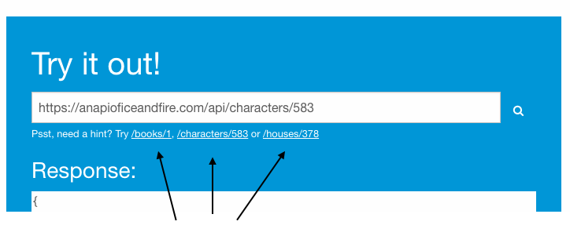
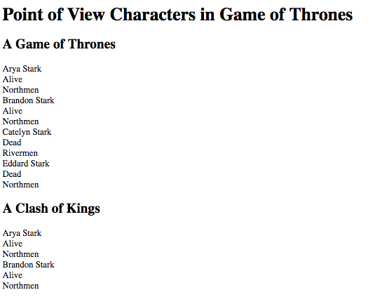

# Game of HTML

<!-- TOC depthFrom:2 -->

- [1. Learning Outcomes](#1-learning-outcomes)
- [2. The Goal](#2-the-goal)
- [3. Preparation](#3-preparation)
  - [3.1. JSON](#31-json)
  - [3.2. Exploring anapioficeandfire.com](#32-exploring-anapioficeandfirecom)
  - [3.3. Using the browser to fetch data from the API](#33-using-the-browser-to-fetch-data-from-the-api)
  - [3.4. Using Postman to fetch data from the API](#34-using-postman-to-fetch-data-from-the-api)
  - [3.5. Using curl to fetch data from the API](#35-using-curl-to-fetch-data-from-the-api)
  - [3.6. Using C# to fetch data from the API](#36-using-c-to-fetch-data-from-the-api)
    - [3.6.1. Deserialize JSON](#361-deserialize-json)
    - [3.6.2. Making the request](#362-making-the-request)
  - [3.7. Reading and Writing Files](#37-reading-and-writing-files)
- [4. The Challenge](#4-the-challenge)
  - [4.1. Step 1 - Basic Content](#41-step-1---basic-content)
  - [4.2. Step 2 - Add Styles](#42-step-2---add-styles)
- [5. The End](#5-the-end)

<!-- /TOC -->

## 1. Learning Outcomes

This exercise will give you some experience with:

- Solving large coding problems
- Git
- C#
- JSON
- Basic HTML and CSS concepts
- Reading and\or writing files in C#
- Network APIs
- NuGet packages
- Debugging
- Postman (optional)

## 2. The Goal

The overall goal is to fetch data from a network API and then write that data into an HTML file.

We will be using data from "An API of Ice and Fire" - https://anapioficeandfire.com/


## 3. Preparation

Before getting into the coding challenge we will cover some topics that will be useful to complete the exercise.

### 3.1. JSON

Like many APIs, anapioficeandfire.com returns data formatted in JavaScript Object Notation (JSON). Therefore it will be helpful to know about JSON. w3schools provides a good introduction to this data format - https://www.w3schools.com/js/js_json_intro.asp

JSON is a serialization format. As explained [here](https://stackoverflow.com/a/2170700/259477):

> *Serialization* is the process of taking an object instance and converting it to a format in which it can be transported across a network or persisted to storage (such as a file or database). The serialized format contains the object's state information. *Deserialization* is the process of using the serialized state to reconstruct the object from the serialized state to its original state.

### 3.2. Exploring anapioficeandfire.com

anapioficeandfire.com provides information about the Game Of Thrones books. Documentation can be found here: https://anapioficeandfire.com/Documentation. The "Resources" section may be of help in completing this challenge.

Go to the "API of Ice and Fire" site (https://anapioficeandfire.com/) and you will see example URLs to use. Click on the links /books/1, /characters/583 etc.



As you can see, the data is being returned serialixed as JSON.

Let's examine the results in more detail. Click on /houses/378, this will return the data found at: https://anapioficeandfire.com/api/houses/378

Take a moment to examine the data. We can see some of the structures described in the w3schools JSON tutorial mentioned above. We can see the key value pairs used in JSON.

A string example
```json
"region": "The Crownlands"
```

The key is `"region"` and the value is `"The Crownlands"`.

There is an array array of strings which are contained withing square brackets - `"["` and `"]"`
```json
"titles": [
  "King of the Andals, the Rhoynar and the First Men",
  "Lord of the Seven Kingdoms",
  "Prince of Summerhall"
]
```

We can see the entire response is actually one big JSON object.

```json
{
	"url": "https://anapioficeandfire.com/api/houses/378",
	"name": "House Targaryen of King's Landing",
  ...
  ...
  ...
		"https://anapioficeandfire.com/api/characters/2128"
	]
}
```

This root object does not have a key. In this case it is a single object but it is possible for it to be an array e.g. https://anapioficeandfire.com/api/characters

Notice the response starts with brackets

```json
[
  {
    "url": "https://anapioficeandfire.com/api/characters/1",
    "name": "",
    "gender": "Female",
    "culture": "Braavosi",
```

### 3.3. Using the browser to fetch data from the API

Placing a URL into the address bar and pressing `ENTER` results in the browser making a `GET` request to the server. The server processes the request and returns the results.

Open Chrome and copy some of the API urls into the address bar and press `ENTER`:

- https://anapioficeandfire.com/api/books/1
- https://anapioficeandfire.com/api/characters/583
- https://anapioficeandfire.com/api/houses/378

These URLs retrieve a single resource e.g. one book.

If the results are not being shown in a readable format, you may want to add a Chrome extension that can format JSON, e.g. JSONView - https://chrome.google.com/webstore/detail/jsonview/chklaanhfefbnpoihckbnefhakgolnmc

### 3.4. Using Postman to fetch data from the API

Postman is a tool that can be used to make API requests. You can download it from here: https://www.getpostman.com/apps

This page explains how to make requests: https://www.getpostman.com/docs/v6/postman/launching_postman/sending_the_first_request

Perform `GET` requests on these URLs

- https://anapioficeandfire.com/api/books
- https://anapioficeandfire.com/api/characters
- https://anapioficeandfire.com/api/houses

Note how the URLs are different here. They are retrieving a list of resources, not just a specific one.

### 3.5. Using curl to fetch data from the API

Curl is a command line tool, often used by developers to make quick calls to APIs. To try this out open Git Bash, and copy this line into it:

```
curl https://anapioficeandfire.com/api/houses/1
```
For a pretty print (formatted) output try:

```
curl https://anapioficeandfire.com/api/houses/1 | json_pp
```

This was a `GET` request, but you can perform all the HTTP requests with curl e.g. `POST`, `PUT`, `DELETE` etc

### 3.6. Using C# to fetch data from the API

There are two challenges to overcome when consuming data from an API serving JSON

- Desrializing the JSON
- Requesting the DATA

#### 3.6.1. Deserialize JSON

When making a request in C# it is common for a response to be returned as a string. This string contains the JSON response. JSON is serialized data. To use this in C# we need to convert the JSON string into a C# object - this is known as deserialization.

There are numerous libraries that can be used to deserialize JSON. Json.Net (https://www.newtonsoft.com/json) is one of the most popular libraries. This can be installed through NuGet Package manager.

You can see an example here:

- https://www.newtonsoft.com/json/help/html/SerializingJSON.htm
- https://www.newtonsoft.com/json/help/html/ParseJsonObject.htm
- https://www.newtonsoft.com/json/help/html/DeserializeWithLinq.htm

These are tutorials showing how to use Json.NET to deserialize JSON.

- https://www.c-sharpcorner.com/UploadFile/manas1/json-serialization-and-deserialization-using-json-net-librar/
- https://community.jivesoftware.com/thread/282037

#### 3.6.2. Making the request

There are a number of different ways to make requests in C#. This write explains some of the popular C# approaches: https://code-maze.com/different-ways-consume-restful-api-csharp/#HttpWebRequest

Notice the use of `JArray` from Json.Net in those examples. That shows a convenient way of deserializing a JSON array.

Make sure that you read a few of the options there before you decide which to try first.

### 3.7. Reading and Writing Files

To solve this challenge you need to be able to write to text files. It may also be helpful to be able to read from files _hint hint_.

This tutorial shows how to read and write to files in C# - http://csharp.net-tutorials.com/file-handling/reading-and-writing/

Look out for:

- File.ReadAllText
- File.WriteAllText

Also note where your file is being placed. I suspect that if you don't supply a full path or relative path, the file will end up in the `bin/debug` folder.

## 4. The Challenge

Now that we have covered most of the tools and technologies needed to perform this coding challenge, we can get into the details. Please note that the steps below are a guide, but they are not detailed instructions.

The challenge is to use anapioficeandfire.com to create an html file displaying all the books, and each point of view (POV) character in each book.

A rough depiction of this would be:

```
Book Title
  Character name, Alive\Dead, culture
  Character name, Alive\Dead, culture
  Character name, Alive\Dead, culture
  ...
Book Title
  Character name, Alive\Dead, culture
  Character name, Alive\Dead, culture
  Character name, Alive\Dead, culture
  ...
Book Title
  Character name, Alive\Dead, culture
  Character name, Alive\Dead, culture
  Character name, Alive\Dead, culture
  ...
```

First we will write a C# program that will generate a basic HTML file, which does not contain any styling (no classes or CSS). In step 2 we will add CSS and the required classes.

### 4.1. Step 1 - Basic Content

Your objective here is to generate an HTML file, which does not have any style, just proper HTML tags with content. Have a look at the sample html file found in `game-of-html/samples/index.html`

Your HTML document must start the same way with

- a doctype
- opening the `html` and `body` tags
- declare a page header which uses a `div` and `h1`

This section in `game-of-html/samples/index.html` is:

```
<!DOCTYPE html>
<html>
  <body>
    <div><h1>Point of View Characters in Game of Thrones</h1></div>

```
You also need to close these tags, make sure you place this at the end of the file

```
  </body>
</html>
```

In the middle of these parts comes the books and characters section. For each book you need to add the book title and some details for each of the POV characters (povCharacters) in that book.

`game-of-html/samples/index.html` shows two books, with a few of the POV characters.

The title of the book should be added as follows:

```
  <h2>A Game of Thrones</h2>
```
Then add some details of each POV character. The details needed are the "name", "Alive\Dead", and "culture".

These details must be added with the expected HTML tags.

```
    <div>
      <div>
        <div>Arya Stark</div>
        <div>Alive</div>
        <div>Northmen</div>
      </div>
      <div>
        <div>Brandon Stark</div>
        <div>Alive</div>
        <div>Northmen</div>
      </div>
    </div>
```

In your html file you should include all the POV characters for the book, and then repeat this for all the other books.

Once you are generating this file correctly, you should be able open the file in a browser and see something similar to:




### 4.2. Step 2 - Add Styles

Next we will add styling through classes and CSS.

Add the following `head` section

```
<!DOCTYPE html>
<html>
  <head>
    <link href="https://fonts.googleapis.com/css?family=Lato" rel="stylesheet">
    <link href="https://fonts.googleapis.com/css?family=Merienda" rel="stylesheet">
    <link href="style.css" rel="stylesheet">
  </head>
  <body>
```

That will include two google fonts and a local reference to a CSS file. This file needs to be placed next to the HTML file you are creating. Copy\paste `samples/style.css` so that it is next to the html file that you are generating.

Add the following classes to the page header

```
<div class="header-section shadow"><h1>Point of View Characters in Game of Thrones</h1></div>
```

Add the following classes to the books title

```
    <h2 class="book-title shadow">A Game of Thrones</h2>
```

This sample shows the remaining classes which are needed:

```
    <div class="characters">
      <div class="character shadow dead">
        <div>Jon Snow</div>
        <div>Dead</div>
        <div>Northmen</div>
      </div>
      <div class="character shadow">
        <div>Arya Stark</div>
        <div>Alive</div>
        <div></div>
      </div>
```

Note the extra class for "dead" characters.

Once this has been done correctly the page should show blue and grey blocks. The page should also be responsive - make the page thinner and the layout should change.

Take a screenshot of the page and share it on slack, and I will tell you if it looks correct 😃

## 5. The End

If you managed this, congratulations!!!


_Please let us know on slack if you found this helpful._
